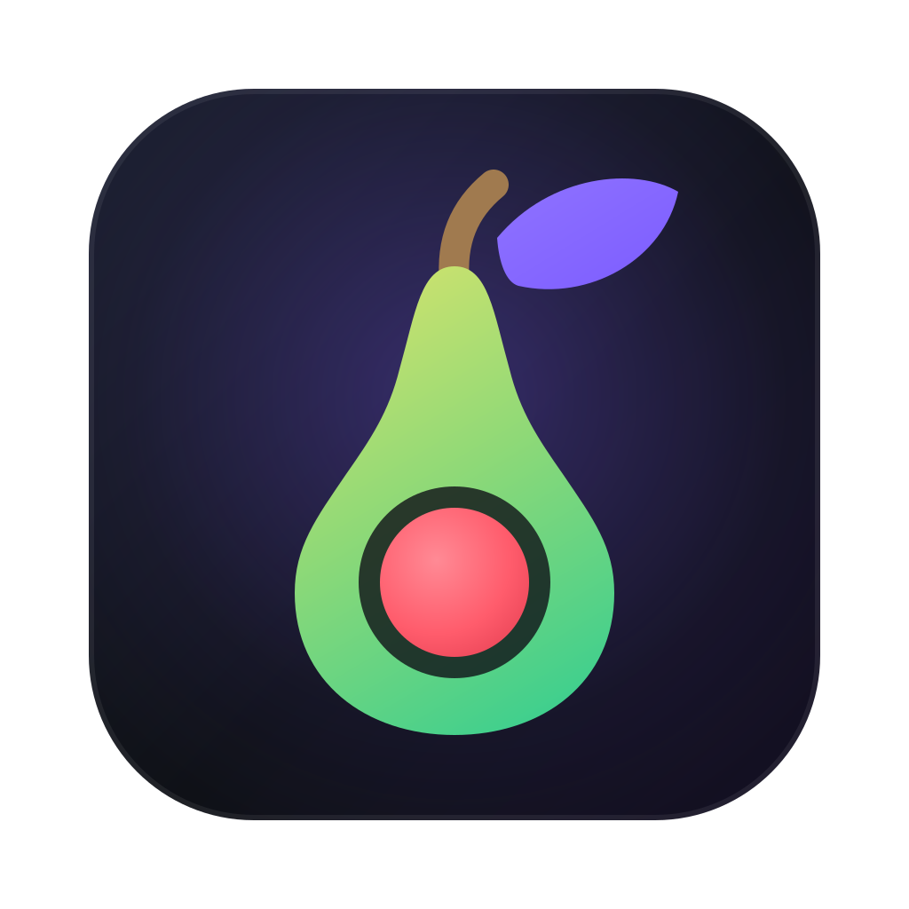
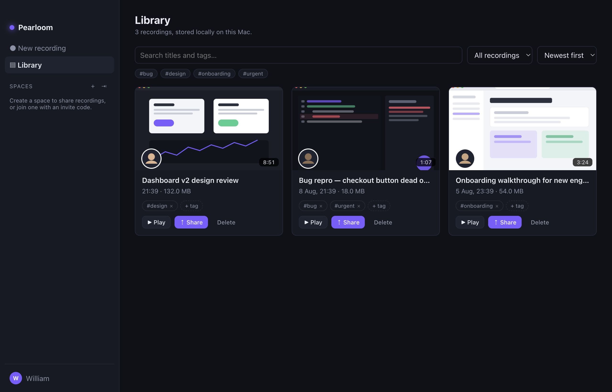

# Pearloom

[](LICENSE)
[](https://buymeacoffee.com/willlacf)

A free, peer-to-peer screen-recording and feedback app for macOS — a Loom alternative with no servers, no accounts, and no upload, built on the [Pear](https://docs.pears.com) stack (Hypercore / Hyperswarm / Hyperdrive / Autobase by Holepunch).

Record your screen with a camera bubble and narration, keep everything **local**, then share selected recordings directly with teammates — streamed peer-to-peer over encrypted, hole-punched connections. Invitees can watch and leave timestamped comments that sync back to you.



## Download

Grab the newest zip from [Releases](https://github.com/liywjl/pearloom/releases) — `mac-arm64` for Apple Silicon, `mac-x64` for Intel — unzip, and drag `Pearloom.app` into Applications. Each release's notes say whether that build is signed & notarized; unsigned builds need one command after unzipping (`xattr -dr com.apple.quarantine Pearloom.app`) or just build from source (four commands, below).

## Features

- **Screen recording** — pick any screen or window (thumbnail picker), 30 fps. Recording keeps running while you work in other apps and while you navigate inside Pearloom (a floating HUD follows you; the window is exempt from background throttling).
- **Menu-bar recording mode** — when recording starts, the app window hides out of your way; a menu-bar item shows a live `🔴 0:42` timer with Stop / Show controls, and everything comes back when you stop.
- **Desktop face bubble** — with the camera on, your face floats on the desktop in a draggable always-on-top circle (with timer + stop button) while you present. The bubble window is content-protected, so the screen capture never sees it — the recording gets the composited camera bubble exactly once.
- **Cursor & click overlays** — a little red cursor dot is burned into the video the whole time (macOS captures normally hide the pointer; needs no permission), with red rings on every click (Accessibility permission; full-screen recordings).
- **Activity timeline** — clicks and typing *timing* (never key contents) are captured while recording and rendered as ticks on the playback timeline, so reviewers can see where the action is.
- **Camera bubble** — choose a camera; it's composited into the recording as a circular Loom-style overlay. Or go screen-only.
- **Microphone selection** — pick any input, or record silent.
- **Local-first library** — recordings are `.webm` files on disk with instant playback (Range-streaming via a custom `pearloom://` protocol). Search titles and tags, filter by shared/private/tag, sort by date/length/size, rename, **tag** (tags travel with published recordings), and delete. Recordings interrupted by a crash are auto-recovered on next launch.
- **Spaces** — multi-writer P2P rooms. Publish a recording into a space, send a one-line invite code, and members sync it directly from you (end-to-end encrypted, hole-punched connections).
- **Progressive P2P playback** — viewers stream videos before they've fully downloaded (HTTP Range requests served from a sparse Hyperdrive).
- **Feedback** — an interactive timeline bar under the player: click to jump, **drag to select a section and comment on it**, emoji reactions pinned to timestamps, likes on comments, and every marker (comments, sections, reactions, activity) clickable — all converged via Autobase.
- **Feedback everywhere** — the player shows the same comments/reactions for a recording whether you open it from your Library or from a space (shared to several spaces? pick which one's feedback to view). Unshared recordings offer a one-click "Share to collect feedback", and the feedback panel shows the members who can watch plus an "Invite reviewers" button.

## Stack

Everything is TypeScript/JavaScript — no Swift, no native code of our own.

| Layer | Technology |
| --- | --- |
| Shell | Electron (main = thin shell + IPC, renderer = sandboxed React UI) |
| Capture | `desktopCapturer` + `getUserMedia`/`getDisplayMedia`, canvas compositing, `MediaRecorder` |
| P2P identity & rooms | [Autobase](https://docs.pears.com/reference/building-blocks/autobase/) (multi-writer) with a [Hyperbee](https://docs.pears.com/reference/building-blocks/hyperbee/) view |
| Invites | [blind-pairing](https://github.com/holepunchto/blind-pairing) + z32 invite codes |
| Video blobs | [Hyperdrive](https://docs.pears.com/reference/building-blocks/hyperdrive/) (one per member per space) |
| Networking | [Hyperswarm](https://docs.pears.com/reference/building-blocks/hyperswarm/) (DHT + hole punching), one [Corestore](https://docs.pears.com/reference/helpers/corestore/) replicated per connection |
| P2P → `<video>` | [serve-drive](https://github.com/holepunchto/serve-drive) (localhost HTTP gateway, token-authed, Range support) |

### How sharing works

```
┌────────────┐   invite code (z32, out-of-band)   ┌────────────┐
│   Alice    │ ─────────────────────────────────▶ │    Bob     │
│            │                                    │            │
│ Autobase ──┼──── blind-pairing handshake ──────▶│ added as   │
│ (space)    │◀─── Hyperswarm (E2E encrypted) ───▶│ writer     │
│            │                                    │            │
│ Hyperdrive ┼── video blocks stream on demand ──▶│ <video>    │
│ (.webm)    │                                    │ via local  │
│            │◀───── comments (Autobase) ─────────│ HTTP       │
└────────────┘                                    └────────────┘
```

A **space** is an encrypted Autobase whose Hyperbee view holds space metadata, members, published recording records, and comments. Publishing copies the `.webm` into your per-space Hyperdrive and appends a record pointing at `(driveKey, path)`. Peers resolve that drive over the same swarm connections and stream it locally through `serve-drive`.

Because it's pure P2P: **someone with the data must be online** for a new peer to fetch it (the sharer, or any member who already synced a copy). Comments and metadata are tiny and sync in seconds whenever any two members are online together. For always-on availability you can run a [blind-peering](https://github.com/holepunchto/blind-peering) node — see Roadmap.

## Development

```sh
npm install
npm start            # build + launch
npm run dev          # esbuild watch mode (run `electron .` separately)
npm test             # unit tests + 2-peer P2P integration test (local DHT testnet)
npm run typecheck
```

On first record, macOS will prompt for camera/microphone consent, and you must grant **Screen Recording** to the app (System Settings → Privacy & Security) — the app deep-links you there. Click highlights additionally need **Accessibility** (the toggle in the recorder prompts for it). In dev the permissions are attributed to "Electron"; in a packaged build, to "Pearloom".

Useful flags: `electron . --devtools` opens DevTools; `electron . --screenshot out.png` captures the UI and exits (used for smoke tests).

### Try the P2P flow on one machine

The integration test (`tests/p2p.test.ts`) exercises the full flow — space creation, publish, invite, pairing, P2P streaming with Range requests, and two-way comments — against a throwaway local DHT. To try it by hand, run a second instance with isolated data:

```sh
# terminal 1
npm start
# terminal 2 (second "user")
npx electron . --user-data-dir=/tmp/pearloom-peer-b
```

Record in one, share → copy the invite code, join from the other.

## Packaging (downloadable .app)

```sh
npm run package      # → out/Pearloom-darwin-arm64/Pearloom.app
```

The packaged app embeds camera/mic usage strings (`build/Info.extend.plist`) and the app icon (`build/icon.icns`).

### Signing & notarization

The build above is **unsigned**. That's fine for an app you built yourself, but a copy downloaded from the internet gets quarantined by Gatekeeper ("Pearloom is damaged / can't be opened"). If you distribute binaries:

1. Sign with a **Developer ID Application** certificate (`@electron/osx-sign`) and a hardened runtime + entitlements for camera/microphone.
2. Notarize with Apple (`@electron/notarize`) and staple the ticket.

Until releases are signed, the supported install path is **build from source** (four commands above), or strip the quarantine flag yourself on a machine you trust: `xattr -dr com.apple.quarantine Pearloom.app`.

Releases are automated: pushing a `v*` tag runs [release.yml](.github/workflows/release.yml), which tests, packages both architectures, signs + notarizes when the repo has signing secrets (bootstrap them with `scripts/setup-signing.sh`), and publishes the zips as a GitHub Release.

Two signing-adjacent gotchas worth knowing:

- macOS privacy permissions (Screen Recording, Accessibility, camera/mic) are keyed to the app's bundle ID + signature. Unsigned/ad-hoc builds can be re-prompted after every rebuild; a stable signature makes permissions stick.
- Your P2P identity keys are **not** in this repo or in the app bundle — they're generated on first launch and live in the per-user data directory (`~/Library/Application Support/Pearloom`), so publishing this code (or an unsigned build) never ships anyone's keys.

### Pear-native deployment (optional)

The app is built the way current Pear desktop apps are (plain Electron + the Pear data stack). To distribute updates peer-to-peer the Pear way:

```sh
pear touch           # mint a pear:// link, put it in package.json "upgrade"
pear stage <link> .  # sync a build into the link's Hyperdrive
pear seed <link>     # keep it available to peers
```

and wire [`pear-runtime`](https://www.npmjs.com/package/pear-runtime) into the main process for OTA updates (see [hello-pear-electron](https://github.com/holepunchto/hello-pear-electron)).

## Project layout

```
src/
  shared/types.ts        IPC data contracts (single source of truth)
  main/                  Electron main process
    index.ts             boot, window, teardown
    capture.ts           screen/window sources, display-media handler, macOS permissions
    recordings.ts        local .webm store + JSON index (pure Node, unit-tested)
    protocol.ts          pearloom:// Range-streaming for local playback
    http-range.ts        Range header parsing (unit-tested)
    ipc.ts               ipcMain handlers + event forwarding
    p2p/
      engine.ts          Corestore + Hyperswarm + serve-drive + space registry
      space.ts           one Autobase room: apply reducer, invites, publish, comments
  preload/index.ts       contextBridge API (window.pearloom)
  renderer/              sandboxed React UI (no Node access)
    recorder/            device selection hook + canvas compositor
    views/               Record / Library / Space / Player
tests/                   vitest: unit + 2-peer end-to-end over hyperdht testnet
```

## Security notes

- Space contents are encrypted at rest and in transit; only invited members hold the key.
- Invite codes are single-space bearer credentials — share them over a channel you trust.
- The renderer is sandboxed with `contextIsolation`; all privileged work crosses a typed preload bridge.
- The local video gateway binds to `127.0.0.1` with a per-session random token.

## Roadmap ideas

- System-audio capture (macOS requires a loopback driver or ScreenCaptureKit audio).
- Always-on availability via a `blind-peering` mirror node.
- OTA updates over Pear (`pear-runtime`), download-for-offline, per-recording share links, mp4 remux.

## Contributing

Issues and PRs welcome — see [CONTRIBUTING.md](CONTRIBUTING.md). If Pearloom is useful to you, you can [buy me a coffee](https://buymeacoffee.com/willlacf). ☕

## License

[MIT](LICENSE)
